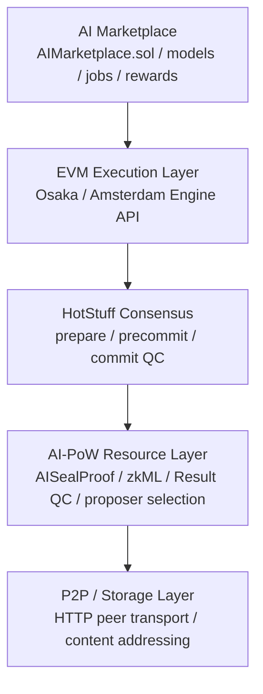

# AI-PoW Unified DAG Chain

This is a development implementation of a decentralized AI network that connects an AI Marketplace, EVM execution layer, 4-node HotStuff, AI-PoW, Unified AI-DAG, and content-addressed storage.

> **Important:** This is a devnet MVP for validating protocol integration. It is not an audited or production-ready blockchain.

## Implemented Architecture



Each layer corresponds to the following code:

- Marketplace: `contracts/AIMarketplace.sol`
- EVM: `internal/engine` and `internal/evm`
- HotStuff: `internal/hotstuff`
- AI-PoW / semantic proof: `internal/aipow`, `internal/aiseal`, `internal/zkml`
- P2P/Storage: `internal/node`, `internal/miner`, `internal/storage`

## Node Separation

The HotStuff validator and the AI miner are separate processes.

### Lightweight HotStuff Validator

- Does not generate or hold the AI-DAG
- Does not load the model
- Reads only the sample pages included in the proof and verifies the AISealProof
- Verifies the zkML proof using only the Groth16 verifying key; the proving key and model witness are not required
- Verifies Ed25519 signatures for the PoW ticket, inference attestation, and HotStuff vote
- Verifies Result QC using identical result attestations from at least 3/4 of participants
- Re-executes the payload using each validator’s own execution client
- Advances `prepare -> precommit -> commit` and finalizes with a QC of 3/4 votes
- Stores and distributes finalized blocks and proofs by content hash

### AI Miner Sidecar

- Holds the Unified AI-DAG and Merkle sidecar
- Selects the required pages from the challenge and generates an AISealProof
- Searches for the outer AI-PoW nonce
- Stores proofs in the content-addressed store
- Executes quantized inference and can generate Groth16 proofs
- Returns signed tickets, AI results, inference attestations, and proofs to validators

## Quick Start

Go 1.25.7 or later is required.

```powershell
go mod tidy
go test ./...
go run ./cmd/aidchaind demo --rounds 3 --difficulty 10 --engine-fork osaka
```

By default, it starts 4 validators, 4 miner sidecars, and 4 deterministic mock execution engines.

```text
four-node devnet ready (quorum=3, difficulty=10)
finalized height=1 proposer=node3 block=0x... ai=0x... execution=0x... votes=4
all four nodes agree at height 3
```

To use Amsterdam-format payloads:

```powershell
go run ./cmd/aidchaind demo --rounds 3 --engine-fork amsterdam
```

## Real AISealProof

The validator recalculates the following without the DAG:

- canonical ManifestRoot
- page header, payload hash, and page commit
- PoW/Tensor Merkle path
- challenge-dependent sample index
- `mixDigest`
- tensor page challenge and `aiDigest`
- `workHash` and arbitrary target
- canonical `proofHash`
- binding to block hash, miner, epoch, and sample count
- resource limits for proof byte size, page count, and page size

Create a DAG with the existing generator.

```powershell
go run ./cmd/unifiedDAG `
  --out ./aidag/network.bin `
  --size-gb 128 `
  --model ./models/cypheriumai-light-v1-alpha.gguf `
  --seed 'colossusx-ai-dag-v1' `
  --workers 12 `
  --force
```

Demo with the real DAG connected to 4 miners:

```powershell
go run ./cmd/aidchaind demo `
  --rounds 1 `
  --aidag-dag ./aidag/network.bin `
  --aidag-meta ./aidag/network.bin.meta `
  --aidag-sidecar ./aidag/network.bin.sidecar `
  --aiseal-pow-samples 64 `
  --aiseal-tensor-samples 8
```

Even in this case, the validator receives only the manifest and AISealProof. Only the miner sidecar opens the 128 GB DAG body.

For a standalone validator, specify only `--aidag-meta`.

```powershell
go run ./cmd/aidchaind node `
  --id node0 `
  --listen 127.0.0.1:19000 `
  --peers $peers `
  --miners $miners `
  --aidag-meta ./aidag/network.bin.meta `
  --aiseal-pow-samples 64 `
  --aiseal-tensor-samples 8
```

For the miner, specify the full DAG set.

```powershell
go run ./cmd/aidchaind miner `
  --id node0 `
  --listen 127.0.0.1:19100 `
  --aidag-dag ./aidag/network.bin `
  --aidag-meta ./aidag/network.bin.meta `
  --aidag-sidecar ./aidag/network.bin.sidecar `
  --storage-dir ./data/miner0/objects
```

AISealProof proves model/DAG possession and sample access. Verification of the AI output computation is handled by zkML and multi-execution Result QC in the next section.

## zkML and Multi-Execution Result QC

`internal/zkml` is a demonstration zkML circuit using gnark BN254 Groth16. It constrains 8-dimensional, 16-bit quantized linear inference, uses input, weight, and bias as private witnesses, and uses MiMC model/input commitments and output as public inputs. The public output inside the proof is bound to the AI result, worker attestation, and PoW ticket.

Each miner independently performs inference and proof generation, then signs the following with Ed25519:

- height, parent hash, job ID, and full result hash
- model/input/output hash
- worker-specific zkML proof hash

Validators require signatures from at least 3/4 of workers for the same result as Result QC, and they verify each worker, ticket, and proof one-to-one. Since `resultQcRoot` and `zkmlProofsRoot` are committed into the block header, replacing the result, signatures, or proofs changes the block hash.

Generate the Groth16 artifacts once.

```powershell
go run ./cmd/aidchaind zkml-setup --out ./zkml-artifacts
```

The 4-node integrated demo can use either a temporary setup or saved artifacts.

```powershell
go run ./cmd/aidchaind demo --rounds 1 --difficulty 4 --zkml
go run ./cmd/aidchaind demo --rounds 1 --difficulty 4 --zkml-artifacts ./zkml-artifacts
```

For separate processes, pass the verifying artifact to the validator and the proving artifact to the miner.

```powershell
go run ./cmd/aidchaind node  --id node0 --peers $peers --miners $miners --zkml-artifacts ./zkml-artifacts
go run ./cmd/aidchaind miner --id node0 --listen 127.0.0.1:19100 --zkml-artifacts ./zkml-artifacts
```

The current circuit is not a full arbitrary GGUF/Transformer circuit. It is a fixed quantized linear inference circuit that can be cryptographically verified in practice. It guarantees that the computation followed the specified circuit and that multiple workers signed the same result, but it does not guarantee answer quality or factual correctness from a human perspective. General model support requires extensions such as quantized operation circuits, model commitment management, recursive proofs, or a dedicated zkVM.

## EVM Engine API

The Engine API client supports HS256 JWT authentication.

| Fork | Build | Get payload | Validate payload |
|---|---|---|---|
| Osaka | `engine_forkchoiceUpdatedV3` | `engine_getPayloadV5` | `engine_newPayloadV4` |
| Amsterdam | `engine_forkchoiceUpdatedV4` | `engine_getPayloadV6` | `engine_newPayloadV5` |

The default is the released Osaka mode. Amsterdam is a switch mode that follows the official specification.

Connect a separate execution client to each validator.

```powershell
go run ./cmd/aidchaind node `
  --id node0 `
  --listen 127.0.0.1:19000 `
  --peers $peers `
  --miners $miners `
  --engine-url http://127.0.0.1:8551 `
  --engine-jwt ./jwt.hex `
  --engine-genesis-hash 0xYOUR_EXECUTION_GENESIS_HASH `
  --engine-fork osaka `
  --evm-url http://127.0.0.1:8545
```

Block lifecycle:

1. The PoW winner starts payload construction with `forkchoiceUpdated`
2. The execution payload is obtained with `getPayload`
3. The payload and state root are committed into the HotStuff block
4. All validators call `newPayload` and vote only when the response is `VALID`
5. After commit QC, all validators update head/safe/finalized using `forkchoiceUpdated`

Blob transactions are currently rejected. Until an implementation is added to supply versioned hashes from the consensus layer, validators do not vote for payloads where `blobGasUsed != 0`.

Official specifications:

- [Ethereum Engine API](https://github.com/ethereum/execution-apis/tree/main/src/engine)
- [Osaka Engine API](https://github.com/ethereum/execution-apis/blob/main/src/engine/osaka.md)
- [Amsterdam Engine API](https://github.com/ethereum/execution-apis/blob/main/src/engine/amsterdam.md)

## AI Marketplace

`contracts/AIMarketplace.sol` implements the following:

- Model registration with AI-DAG `manifestRoot`
- minimum reward and model owner
- AI jobs with input hash/URI and escrow
- result finalization through a HotStuff threshold oracle
- pull-payment rewards for workers
- requester cancellation after the deadline

It can be compiled with Solidity 0.8.28.

```powershell
npx --yes solc@0.8.28 --bin --abi contracts/AIMarketplace.sol -o ./build/contracts
```

Marketplace transactions are sent to the public EVM JSON-RPC and included in the next payload from the execution client’s mempool. `submit` can forward arbitrary JSON-RPC methods and params.

```powershell
go run ./cmd/aidchaind submit `
  --url http://127.0.0.1:19000 `
  --prompt 'Explain decentralized AI' `
  --evm-method eth_sendRawTransaction `
  --evm-params '["0xSIGNED_MARKETPLACE_TRANSACTION"]'
```

## P2P / Storage

- validator peer transport: propagates HotStuff proposals/QCs between fixed peers over HTTP
- miner transport: exchanges mining challenges, tickets, AISealProofs, zkML proofs, and inference attestations over HTTP
- object ID: `sha256(content)`
- miner proof: `GET /v1/proofs/{contentHash}`
- finalized block: `GET /v1/objects/{contentHash}`
- persistent disk storage with atomic writes when `--storage-dir` is specified
- the block itself also commits the AISeal proof content hash

## HTTP API

Validator:

| Method | Path | Purpose |
|---|---|---|
| `GET` | `/health` | liveness |
| `GET` | `/v1/status` | HotStuff tip, execution head, quorum |
| `GET` | `/v1/blocks` | finalized blocks |
| `GET` | `/v1/objects/{hash}` | content-addressed finalized block |
| `POST` | `/v1/round` | start one round from an AI job |
| `POST` | `/v1/propose` | proposal by the PoW winner |
| `POST` | `/v1/hotstuff/proposal` | prepare vote |
| `POST` | `/v1/hotstuff/qc` | receive QC and advance to the next phase |

Miner sidecar:

| Method | Path | Purpose |
|---|---|---|
| `GET` | `/health` | liveness and role check |
| `GET` | `/v1/proofs/{hash}` | content-addressed AISealProof |
| `POST` | `/v1/mine` | generate AI execution, AISealProof, zkML proof, attestation, and PoW ticket |

## Separate-Process Devnet

```powershell
$peers = 'node0=http://127.0.0.1:19000,node1=http://127.0.0.1:19001,node2=http://127.0.0.1:19002,node3=http://127.0.0.1:19003'
$miners = 'node0=http://127.0.0.1:19100,node1=http://127.0.0.1:19101,node2=http://127.0.0.1:19102,node3=http://127.0.0.1:19103'
```

Start 4 miners on `19100..19103` and 4 validators on `19000..19003`. The keys used in separate-process mode are reproducible devnet keys and must not be used in production.

## Validation

```powershell
go test ./...
go vet ./...
go run ./cmd/aidchaind demo --rounds 3 --engine-fork osaka
go run ./cmd/aidchaind demo --rounds 3 --engine-fork amsterdam
go run ./cmd/aidchaind demo --rounds 1 --difficulty 4 --zkml
```

Test coverage:

- successful AISealProof verification and rejection of page tampering
- successful Groth16 proof verification, rejection of public-output tampering, and artifact reload
- integration from zkML generation by 4 miners to HotStuff finalization
- Result QC acceptance with 3/4 and rejection with 2/4
- rejection of result tampering after signature
- rejection of PoW tampering
- HotStuff 3-phase commit and double-vote rejection
- Engine API method versions, JWT, and `VALID` judgment
- only the PoW winner constructs the payload
- payload validation and finalization by all validators
- validator/miner process separation
- content-addressed storage of finalized blocks

## Source Layout

```text
contracts/AIMarketplace.sol  EVM AI marketplace
cmd/aidchaind                devnet / validator / miner / zkML setup / submit CLI
cmd/unifiedDAG               Unified AI-DAG generator/prover
internal/aiseal              DAG-free AISealProof verifier and file prover
internal/aipow               AI receipt and outer PoW
internal/engine              Osaka/Amsterdam Engine API and mock engine
internal/evm                 public EVM JSON-RPC forwarder
internal/hotstuff            validator set, vote, QC, replica
internal/miner               AI miner sidecar
internal/node                validator, P2P transport, round orchestration
internal/storage             content-addressed memory/disk store
internal/protocol            consensus data types and commitments
internal/zkml                BN254 Groth16 quantized inference prover/verifier
```

## Remaining Tasks Before Production Readiness

- HotStuff view change, pacemaker, WAL, restart recovery, and dynamic validator set
- TLS/mTLS transport, peer discovery, bandwidth control, and DoS protection
- replacement of devnet keys with remote signer/HSM
- consensus integration of blob transactions and data availability sampling
- zkML compiler for arbitrary Transformer/GGUF models, recursive/aggregated proofs, and GPU prover
- dispute/TEE/evaluator network for answer quality and factuality outside the circuit
- connection of the Marketplace oracle to a real threshold-signature account
- mempool policy, snapshot, state sync, slashing, rewards, and difficulty adjustment
- fuzzing, long-running fault injection, interoperability with independent implementations, and third-party audit
