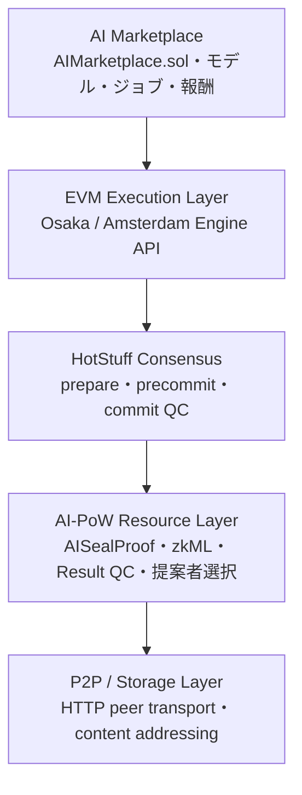

# AI-PoW Unified DAG Chain

AI Marketplace、EVM execution layer、4ノードHotStuff、AI-PoW、Unified AI-DAG、content-addressed storageを接続した分散型AIネットワークの開発用実装です。

> **重要:** プロトコル統合を検証するdevnet MVPです。監査済み・本番利用可能なブロックチェーンではありません。

## 実装済みアーキテクチャ



各レイヤーは次のコードへ対応します。

- Marketplace: `contracts/AIMarketplace.sol`
- EVM: `internal/engine`と`internal/evm`
- HotStuff: `internal/hotstuff`
- AI-PoW / semantic proof: `internal/aipow`、`internal/aiseal`、`internal/zkml`
- P2P/Storage: `internal/node`、`internal/miner`、`internal/storage`

## ノードの分離

HotStuff validatorとAI minerは別プロセスです。

### Lightweight HotStuff validator

- AI-DAGを生成・保持しない
- モデルをロードしない
- 証明に含まれるsample pageだけを読み、AISealProofを検証
- Groth16 verifying keyだけでzkML proofを検証（proving key、モデルwitnessは不要）
- PoW ticket、推論attestation、HotStuff voteのEd25519署名を検証
- 3/4以上の同一結果attestationでResult QCを検証
- 各validator自身のexecution clientでpayloadを再実行
- `prepare -> precommit -> commit`を進め、3/4票のQCで確定
- finalized blockとproofをcontent hashで保存・配信

### AI miner sidecar

- Unified AI-DAGとMerkle sidecarを保持
- challengeから必要pageを選択し、AISealProofを生成
- 外側のAI-PoW nonceを探索
- 証明をcontent-addressed storeへ保存
- 量子化推論を実行しGroth16 proofを生成可能
- 署名付きticket、AI結果、推論attestation、証明をvalidatorへ返す

## クイックスタート

Go 1.25.7以降が必要です。

```powershell
go mod tidy
go test ./...
go run ./cmd/aidchaind demo --rounds 3 --difficulty 10 --engine-fork osaka
```

デフォルトでは4 validator、4 miner sidecar、4つの決定論的mock execution engineを起動します。

```text
four-node devnet ready (quorum=3, difficulty=10)
finalized height=1 proposer=node3 block=0x... ai=0x... execution=0x... votes=4
all four nodes agree at height 3
```

Amsterdam形式のpayloadを使う場合:

```powershell
go run ./cmd/aidchaind demo --rounds 3 --engine-fork amsterdam
```

## 本物のAISealProof

validatorはDAGなしで次を再計算します。

- canonical ManifestRoot
- page header、payload hash、page commit
- PoW/Tensor Merkle path
- challenge依存のsample index
- `mixDigest`
- tensor page challengeと`aiDigest`
- `workHash`と任意のtarget
- canonical `proofHash`
- block hash、miner、epoch、sample数とのbinding
- proof byte数、page数、page sizeのresource limit

既存generatorでDAGを作成します。

```powershell
go run ./cmd/unifiedDAG `
  --out ./aidag/network.bin `
  --size-gb 128 `
  --model ./models/cypheriumai-light-v1-alpha.gguf `
  --seed 'colossusx-ai-dag-v1' `
  --workers 12 `
  --force
```

実DAGを4 minerへ接続したdemo:

```powershell
go run ./cmd/aidchaind demo `
  --rounds 1 `
  --aidag-dag ./aidag/network.bin `
  --aidag-meta ./aidag/network.bin.meta `
  --aidag-sidecar ./aidag/network.bin.sidecar `
  --aiseal-pow-samples 64 `
  --aiseal-tensor-samples 8
```

この場合もvalidatorが受け取るのはmanifestとAISealProofだけです。128GB DAG本体を開くのはminer sidecarだけです。

単独validatorでは`--aidag-meta`のみを指定します。

```powershell
go run ./cmd/aidchaind node `
  --id node0 `
  --listen 127.0.0.1:19000 `
  --peers $peers `
  --miners $miners `
  --aidag-meta ./aidag/network.bin.meta `
  --aiseal-pow-samples 64 `
  --aiseal-tensor-samples 8
```

minerにはDAG一式を指定します。

```powershell
go run ./cmd/aidchaind miner `
  --id node0 `
  --listen 127.0.0.1:19100 `
  --aidag-dag ./aidag/network.bin `
  --aidag-meta ./aidag/network.bin.meta `
  --aidag-sidecar ./aidag/network.bin.sidecar `
  --storage-dir ./data/miner0/objects
```

AISealProofはモデル/DAG保有とsample accessを証明します。AI出力の計算検証は、次節のzkMLと複数実行Result QCが担当します。

## zkMLと複数実行Result QC

`internal/zkml`はgnarkのBN254 Groth16を使う実証用zkML回路です。8次元・16 bit量子化linear inferenceを制約化し、入力、重み、biasをprivate witness、MiMC model/input commitmentと出力をpublic inputにします。proof内の公開出力はAI result、worker attestation、PoW ticketへ結合されます。

各minerは独立に推論とproof生成を行い、次へEd25519署名します。

- height、parent hash、job ID、完全なresult hash
- model/input/output hash
- worker固有のzkML proof hash

validatorは同一結果について3/4以上の署名をResult QCとして要求し、worker、ticket、proofを一対一で検証します。`resultQcRoot`と`zkmlProofsRoot`はblock headerへcommitされるため、結果・署名・proofの差し替えはblock hashを変えます。

Groth16 artifactを一度生成します。

```powershell
go run ./cmd/aidchaind zkml-setup --out ./zkml-artifacts
```

4ノード統合demoでは一時setup、または保存済みartifactを使えます。

```powershell
go run ./cmd/aidchaind demo --rounds 1 --difficulty 4 --zkml
go run ./cmd/aidchaind demo --rounds 1 --difficulty 4 --zkml-artifacts ./zkml-artifacts
```

個別プロセスではvalidatorにverifying artifact、minerにproving artifactを渡します。

```powershell
go run ./cmd/aidchaind node  --id node0 --peers $peers --miners $miners --zkml-artifacts ./zkml-artifacts
go run ./cmd/aidchaind miner --id node0 --listen 127.0.0.1:19100 --zkml-artifacts ./zkml-artifacts
```

現在の回路は任意のGGUF/Transformer全体ではなく、実際に暗号検証できる固定量子化linear inferenceです。「指定回路どおり計算したこと」と「複数workerが同じ結果へ署名したこと」は保証しますが、人間にとっての回答品質・事実性までは保証しません。一般モデル対応には量子化演算回路、モデルcommitment管理、再帰証明または専用zkVMの拡張が必要です。

## EVM Engine API

Engine API clientはHS256 JWT認証に対応します。

| Fork | Build | Get payload | Validate payload |
|---|---|---|---|
| Osaka | `engine_forkchoiceUpdatedV3` | `engine_getPayloadV5` | `engine_newPayloadV4` |
| Amsterdam | `engine_forkchoiceUpdatedV4` | `engine_getPayloadV6` | `engine_newPayloadV5` |

デフォルトはリリース済みOsakaです。Amsterdamは公式仕様に追従する切替モードです。

各validatorへ個別のexecution clientを接続します。

```powershell
go run ./cmd/aidchaind node `
  --id node0 `
  --listen 127.0.0.1:19000 `
  --peers $peers `
  --miners $miners `
  --engine-url http://127.0.0.1:8551 `
  --engine-jwt ./jwt.hex `
  --engine-genesis-hash 0xYOUR_EXECUTION_GENESIS_HASH `
  --engine-fork osaka `
  --evm-url http://127.0.0.1:8545
```

block lifecycle:

1. PoW winnerが`forkchoiceUpdated`でpayload構築を開始
2. `getPayload`でexecution payloadを取得
3. payloadとstate rootをHotStuff blockへcommit
4. 全validatorが`newPayload`を呼び、`VALID`の場合だけvote
5. commit QC後、全validatorが`forkchoiceUpdated`でhead/safe/finalizedを更新

blob transactionは現在拒否します。versioned hashをconsensus layerから供給する実装を追加するまで、`blobGasUsed != 0`のpayloadへvoteしません。

公式仕様:

- [Ethereum Engine API](https://github.com/ethereum/execution-apis/tree/main/src/engine)
- [Osaka Engine API](https://github.com/ethereum/execution-apis/blob/main/src/engine/osaka.md)
- [Amsterdam Engine API](https://github.com/ethereum/execution-apis/blob/main/src/engine/amsterdam.md)

## AI Marketplace

`contracts/AIMarketplace.sol`は次を実装します。

- AI-DAG `manifestRoot`付きモデル登録
- minimum rewardとmodel owner
- input hash/URI付きAIジョブとescrow
- HotStuff threshold oracleによる結果確定
- workerへのpull-payment報酬
- deadline後の依頼者キャンセル

Solidity 0.8.28でコンパイルできます。

```powershell
npx --yes solc@0.8.28 --bin --abi contracts/AIMarketplace.sol -o ./build/contracts
```

Marketplace transactionはpublic EVM JSON-RPCへ送り、execution clientのmempoolから次payloadへ取り込みます。`submit`は任意のJSON-RPC method/paramsを転送できます。

```powershell
go run ./cmd/aidchaind submit `
  --url http://127.0.0.1:19000 `
  --prompt 'Explain decentralized AI' `
  --evm-method eth_sendRawTransaction `
  --evm-params '["0xSIGNED_MARKETPLACE_TRANSACTION"]'
```

## P2P / Storage

- validator peer transport: HotStuff proposal/QCを固定peer間HTTPで伝播
- miner transport: mining challenge、ticket、AISealProof、zkML proof、推論attestationをHTTPで交換
- object ID: `sha256(content)`
- miner proof: `GET /v1/proofs/{contentHash}`
- finalized block: `GET /v1/objects/{contentHash}`
- `--storage-dir`指定時はatomic writeでdiskへ永続化
- block自身もAISeal proof content hashをcommit

## HTTP API

Validator:

| Method | Path | Purpose |
|---|---|---|
| `GET` | `/health` | liveness |
| `GET` | `/v1/status` | HotStuff tip、execution head、quorum |
| `GET` | `/v1/blocks` | finalized blocks |
| `GET` | `/v1/objects/{hash}` | content-addressed finalized block |
| `POST` | `/v1/round` | AI jobから1ラウンド開始 |
| `POST` | `/v1/propose` | PoW winnerによる提案 |
| `POST` | `/v1/hotstuff/proposal` | prepare vote |
| `POST` | `/v1/hotstuff/qc` | QCを受け次phaseへ進む |

Miner sidecar:

| Method | Path | Purpose |
|---|---|---|
| `GET` | `/health` | livenessとrole確認 |
| `GET` | `/v1/proofs/{hash}` | content-addressed AISealProof |
| `POST` | `/v1/mine` | AI実行、AISealProof、zkML proof、attestation、PoW ticket生成 |

## 個別プロセスdevnet

```powershell
$peers = 'node0=http://127.0.0.1:19000,node1=http://127.0.0.1:19001,node2=http://127.0.0.1:19002,node3=http://127.0.0.1:19003'
$miners = 'node0=http://127.0.0.1:19100,node1=http://127.0.0.1:19101,node2=http://127.0.0.1:19102,node3=http://127.0.0.1:19103'
```

4 minerを`19100..19103`、4 validatorを`19000..19003`で起動します。個別プロセスモードの鍵は再現可能なdevnet鍵なので、本番利用は禁止です。

## 検証

```powershell
go test ./...
go vet ./...
go run ./cmd/aidchaind demo --rounds 3 --engine-fork osaka
go run ./cmd/aidchaind demo --rounds 3 --engine-fork amsterdam
go run ./cmd/aidchaind demo --rounds 1 --difficulty 4 --zkml
```

テスト対象:

- AISealProofの正常系とpage改ざん拒否
- Groth16 proofの正常系、公開出力改ざん拒否、artifact再ロード
- 4 minerによるzkML生成からHotStuff確定までの統合
- Result QCの3/4成立、2/4拒否、署名後の結果改ざん拒否
- PoW改ざん拒否
- HotStuff 3-phase commitと二重投票拒否
- Engine API method version、JWT、`VALID`判定
- PoW winnerだけがpayloadを構築すること
- 全validatorによるpayload検証・finalize
- validator/minerのプロセス分離
- finalized blockのcontent-addressed保存

## ソース構成

```text
contracts/AIMarketplace.sol  EVM AI marketplace
cmd/aidchaind                devnet / validator / miner / zkML setup / submit CLI
cmd/unifiedDAG               Unified AI-DAG generator/prover
internal/aiseal              DAG不要のAISealProof verifierとfile prover
internal/aipow               AI receiptと外側PoW
internal/engine              Osaka/Amsterdam Engine APIとmock engine
internal/evm                 public EVM JSON-RPC forwarder
internal/hotstuff            validator set、vote、QC、replica
internal/miner               AI miner sidecar
internal/node                validator、P2P transport、round orchestration
internal/storage             content-addressed memory/disk store
internal/protocol            consensus data typesとcommitment
internal/zkml                BN254 Groth16量子化推論prover/verifier
```

## 本番化前に残る課題

- HotStuff view change、pacemaker、WAL、再起動復旧、動的validator set
- TLS/mTLS transport、peer discovery、帯域制御、DoS対策
- devnet鍵をremote signer/HSMへ置換
- blob transactionとdata availability samplingのconsensus統合
- 任意のTransformer/GGUFを扱うzkML compiler、再帰/集約proof、GPU prover
- 回路外の回答品質・事実性に対するdispute/TEE/評価者ネットワーク
- Marketplace oracleを実際のthreshold署名アカウントへ接続
- mempool policy、snapshot、state sync、slashing、報酬、difficulty調整
- fuzzing、長時間fault injection、独立実装との相互運用、第三者監査
